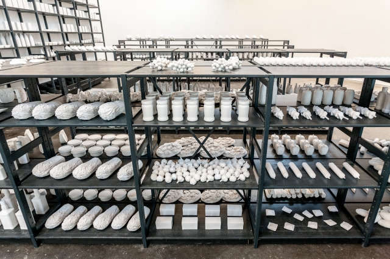

# IDA_2022

# IDA Digital Design - Spring 2022
Willkommen zum IDA Digital Design 2022. 
Instructors: Hanna Züllig, Yann Patrick Martins, Stefanie Bräuer, Pierre Buttin 
Term: Spring 2022, HSLU 

# Unsettling Identities: Von Zu-, Um- und Neuschreibungen
## Data Self Portrait – The Quantified Self
> <i>(...) knowledge – even about the self – is a social product.</i> 
Neff, G., & Nafus, D. (2016). Self-Tracking. MIT Press. https://mitpress.mit.edu/books/self-tracking

Das Modulthema <i>Data Self Portrait – The Quantified Self</i> beinhaltet in seinem Doppeltitel unterschiedliche Sichtweisen und Positionen auf das Selbst und die Daten: von der neugierigen Lust am Messen und Vermessen, Ordnen, Quantifizieren und Visualisieren zur (Selbst-) Analyse von biometrischen Daten und hilfreichen Services, bis zur dekonstruierenden Hacker-Haltung, bei der gegen die ursprünglich intendierte Funktion von Systemen gearbeitet wird, schauen wir uns verschiedene Motivationen und Strategien im breiten Themenfeld an. Die Studierenden entwerfen ihr Konzept, ihre persönlichen Mess-Systeme und erstellen ihre eigenen Datensätze, die sie allenfalls mit weitern Daten verbinden und entwickeln Visualisierungen. Wir führen in Webtechnologien ein, stellen Werkzeuge und Methoden vor, wie Daten getrackt, gespeichert, abgerufen und dargestellt werden können. 

Itamar GilboA, Food Chain Project
http://itamargilboa.com/projects/projects/food-chain-project

# Briefing und Aufgabe
<a href="https://github.com/digitalideation/IDA_2022/blob/main/briefing.md">Briefing und Aufgabe</a>

# Detaillierte Agenda 
<a href="https://docs.google.com/spreadsheets/d/1w5nLr8Dm0PPNobIF_FjWWpALHfDbJUTQDhdUSaxg1_Y/edit?usp=sharing">Live (Check for Updates)</a>

# Illias
https://tinyurl.com/2p99wmz4

# Slack
https://digitalideationstudis.slack.com/archives/C03780GBRGX

# Deliverables Overview
| link zur woche  | deliverables  | due date |
|---|---|---|
| <a href="https://github.com/digitalideation/IDA_2022/blob/main/woche1/readme.md">wk 1 </a>| Erste Ideen, Brainstorming zu eigenem Self Tracking, Austausch, Gruppenbildung. Pro Person eine HTML Einzelseite anlegen, auf der ihr mit Text, Bildern, Links ein Projekt im Themenbereich vorstellt. Das kann eine der Arbeiten aus der Präsentation am Montag sein, eine Arbeit aus dem Schaulager oder HEK oder auch eine selbstgewählte, andere Arbeit. |  28.4.2022  | 
| <a href="https://github.com/digitalideation/IDA_2022/blob/main/woche2/readme.md">wk 2 </a>| Gruppenbildung. Daten Sammlungen anlegen, Dokumentieren, wie und was gemessen wird, Metriken entwerfen. Sammlung von Referenzen, Skizzen, Diagrammen, Fotos für die Visualisierungen. Nachdenken über Zweck der Sammlung, welche Interessen könnten damit bedient werden? Welche Haltung nehmt ihr ein? Präsentation am 5.5.|  5.5.2022  | 
|  |  <i>Workshop Data Portrait</i>|  | 
| <a href="https://github.com/digitalideation/IDA_2022/blob/main/woche3/readme.md">wk 3 </a> | Formalisierte Regeln für Visualisierungen des eigenen Datensatzes erstellen. Skizzen, Skizzen, Skizzen. Anwenden auf Datensatz der Partnerin/des Partners, Skizzen, Skizzen.  |  10.5.2022  |   
|  |  <i>Workshop Data Portrait</i>|  | 
| <a href="https://github.com/digitalideation/IDA_2022/blob/main/woche4/readme.md">wk 4 </a>| Konzept finalisieren, Blick von aussen einnehmen, schärfen. Was sind die tieferen Motivationen und Haltungen? Was wird erzählt? Midterm Präsentation vorbereiten.  |  13.5.2022  |   
| <a href="https://github.com/digitalideation/IDA_2022/blob/main/woche5/readme.md">wk 5 </a>| Sprint 1 Umsetzung, App mit einer Self Tracking Funktion und einfache Ausgabe der Daten  |  20.5.2022  |   
| <a href="https://github.com/digitalideation/IDA_2022/blob/main/woche6/readme.md">wk 6 </a>| Sprint 2 Umsetzung, App mit einer Self Tracking Funktion und Visualisierung(-en) |  27.5.2022  |   
| <a href="https://github.com/digitalideation/IDA_2022/blob/main/woche7/readme.md">wk 7 </a>|  Sprint 3 Iteration und Improvement eines selbstgewählten Aspekts, z.Bsp. Integration von Interaktion,  (Filter, Zoom), Erzählung der Geschichte, ...|    |   
| <a href="https://github.com/digitalideation/IDA_2022/blob/main/woche8/readme.md">wk 8 </a>|  Finalisierung und Schlusspräsentation |  8.6.2022  |   
|  |  Dokumentation |  10.6.2022  | 

# Students Exercise Repo 2022
Baumann Chalid: 
https://ida-cb.netlify.app 
https://github.com/chalidbaumann/IDA-Uebungen.git 

Borer Ruben 
https://uneventfulodyssey.netlify.app/ 
https://github.com/rrmbo/GridModules.git 

Buchfink Niklas 
https://ida-digital-design.netlify.app/ 
https://github.com/NiklasBuchfink/ida-digital-design 

Gujer Mia Kicki 

Hoppeler Larissa Tanya 
https://larissahoppeler.netlify.app/ 
https://github.com/larissa-hoppeler/uebungen  

Kleger Anna 
https://annakleger.netlify.app 
https://github.com/annakleger/kickstartTest-Anna 

Kolly Svenja 
https://svenjakolly.netlify.app 

Münger Lea 
https://ida2022.netlify.app 
https://github.com/leamuenger/IDA2022 

Ramseier Sonja 
https://ida-sr.netlify.app 
https://github.com/sonjaramseier/Github_IDA_repos.git

Santer Noël 
https://ida-noel.netlify.app/ 
https://github.com/noelsanter/IDA-Aufgaben 

Schlegel Balz 

Schmid Céline 
https://ida-22-celine-schmid.netlify.app/ 
https://github.com/celine-schmid/Tag-1.git 

Werner Max 
https://ida-mw.netlify.app/ 
https://github.com/Maxframe/ida-repo 

Widmer Timothy Leopold 
https://baustelle.netlify.app 
https://github.com/timothyschool/GridModules 

Zaugg Tim 
https://rethink-the-web.netlify.app 
https://github.com/ZauggT/IDA2022-Exercise 

